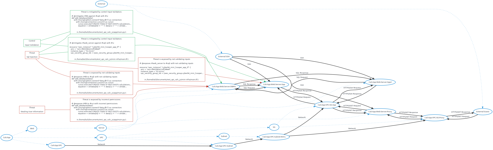

# Threatspec Project Threat Model

A threatspec project.


# Diagram



# Exposures


# Acceptances


# Transfers


# Mitigations


# Reviews


# Connections

##  To CalcApp:Web:Server:DBMS
SQL Request

```
# @connects #web_server to #db with SQL Request
def add_database(data):
    with closing(sqlite3.connect("data.db")) as connection:
        with closing(connection.cursor()) as cursor:
            cursor.execute("CREATE TABLE IF NOT EXISTS calculations (id INTEGER PRIMARY KEY, equation TEXT, result TEXT);")
            equation = str(data[0]) + " " + data[1] + " " + str(data[2])

```
/home/kali/Documents/rest_api_calc_js/app/main.py:1

##  To CalcApp:Web:Server:DBMS
SQL Request

```
# @connects #web_server2 to #db with SQL Request
def add_database(data):
    with closing(sqlite3.connect("data.db")) as connection:
        with closing(connection.cursor()) as cursor:
            cursor.execute("CREATE TABLE IF NOT EXISTS calculations (id INTEGER PRIMARY KEY, equation TEXT, result TEXT);")
            equation = str(data[0]) + " " + data[1] + " " + str(data[2])

```
/home/kali/Documents/rest_api_calc_js/app/main.py:1

## CalcApp:VPC To CalcApp:VPC:Subnet
Network

```
# @connects #vpc to #subnet with Network
resource "aws_subnet" "cyber94_full_lcooper_subnet_app_tf" {
    vpc_id = aws_vpc.cyber94_full_lcooper_vpc_tf.id
    cidr_block = "10.110.1.0/24"

    tags = {

```
/home/kali/Documents/rest_api_calc_js/mini-infra/main.tf:1

## CalcApp:VPC:Subnet:NACL To CalcApp:VPC:SG:App
Network

```
# @connects #nacl_app to #sg_app with Network
resource "aws_security_group" "cyber94_full_lcooper_sg_app_tf" {
    name = "cyber94_full_lcooper_sg_app"
    vpc_id = aws_vpc.cyber94_full_lcooper_vpc_tf.id

    ingress {

```
/home/kali/Documents/rest_api_calc_js/mini-infra/main.tf:1

## CalcApp:VPC:SG:App To 
Network

```
# @connects #sg_app to #web_server with Network
resource "aws_security_group" "cyber94_full_lcooper_sg_app_tf" {
    name = "cyber94_full_lcooper_sg_app"
    vpc_id = aws_vpc.cyber94_full_lcooper_vpc_tf.id

    ingress {

```
/home/kali/Documents/rest_api_calc_js/mini-infra/main.tf:1

## CalcApp:VPC:SG:App To 
Network

```
# @connects #sg_app to #web_server2 with Network
resource "aws_security_group" "cyber94_full_lcooper_sg_app_tf" {
    name = "cyber94_full_lcooper_sg_app"
    vpc_id = aws_vpc.cyber94_full_lcooper_vpc_tf.id

    ingress {

```
/home/kali/Documents/rest_api_calc_js/mini-infra/main.tf:1

## CalcApp:VPC:Subnet:NACL To CalcApp:VPC:SG:Proxy
Network

```
# @connects #nacl_app to #sg_proxy with Network
resource "aws_security_group" "cyber94_full_lcooper_sg_proxy_tf" {
    name = "cyber94_full_lcooper_sg_proxy"
    vpc_id = aws_vpc.cyber94_full_lcooper_vpc_tf.id

    ingress {

```
/home/kali/Documents/rest_api_calc_js/mini-infra/main.tf:1

## CalcApp:VPC:Subnet To CalcApp:VPC:Subnet:NACL
Network

```
# @connects #subnet to #nacl_app with Network
resource "aws_network_acl" "cyber94_full_lcooper_nacl_app_tf" {
  vpc_id = aws_vpc.cyber94_full_lcooper_vpc_tf.id
  subnet_ids = [aws_subnet.cyber94_full_lcooper_subnet_app_tf.id]

  ingress {

```
/home/kali/Documents/rest_api_calc_js/mini-infra/main.tf:1


# Components

## 

## CalcApp:Web:Server:DBMS

## 

## CalcApp:VPC

## CalcApp:VPC:Subnet

## CalcApp:VPC:Subnet:NACL

## CalcApp:VPC:SG:App

## CalcApp:VPC:SG:Proxy


# Threats


# Controls
