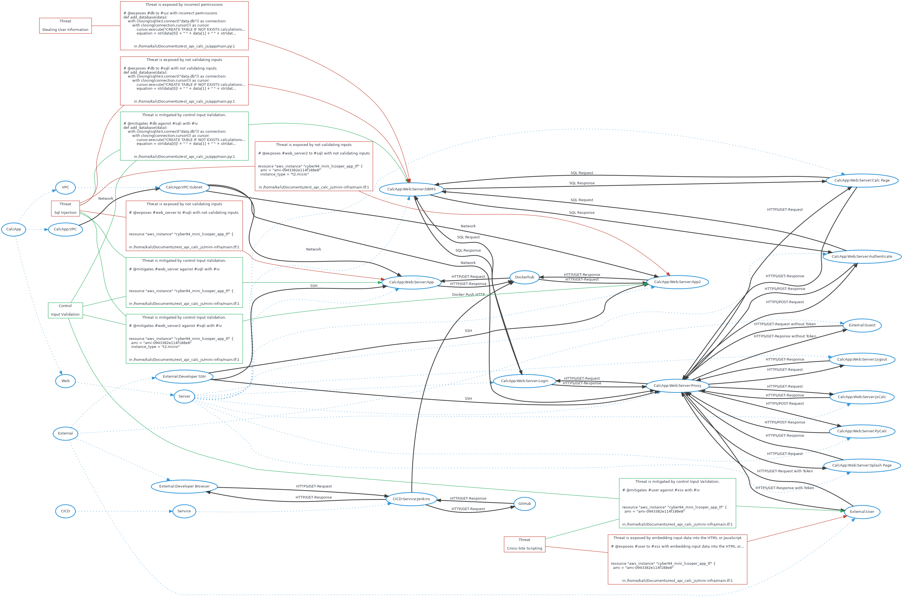

# Threatspec Project Threat Model

A threatspec project.


# Diagram



# Exposures

## Stealing user information against CalcApp:Web:Server:DBMS
Incorrect permissions

```
# @exposes #db to #sui with incorrect permissions
def add_database(data):
    with closing(sqlite3.connect("data.db")) as connection:
        with closing(connection.cursor()) as cursor:
            cursor.execute("CREATE TABLE IF NOT EXISTS calculations (id INTEGER PRIMARY KEY, equation TEXT, result TEXT);")
            equation = str(data[0]) + " " + data[1] + " " + str(data[2])

```
/home/kali/Documents/rest_api_calc_js/app/main.py:1

## Sql injection against CalcApp:Web:Server:DBMS
Not validating inputs

```
# @exposes #db to #sqli with not validating inputs
def add_database(data):
    with closing(sqlite3.connect("data.db")) as connection:
        with closing(connection.cursor()) as cursor:
            cursor.execute("CREATE TABLE IF NOT EXISTS calculations (id INTEGER PRIMARY KEY, equation TEXT, result TEXT);")
            equation = str(data[0]) + " " + data[1] + " " + str(data[2])

```
/home/kali/Documents/rest_api_calc_js/app/main.py:1

## Sql injection against CalcApp:Web:Server:App
Not validating inputs

```
# @exposes #web_server to #sqli with not validating inputs


resource "aws_instance" "cyber94_mini_lcooper_app_tf" {

```
/home/kali/Documents/rest_api_calc_js/mini-infra/main.tf:1

## Cross-site scripting against CalcApp:Web:Server:App
Embedding input data into the html or javascript

```
# @exposes #web_server to #xss with embedding input data into the HTML or JavaScript


resource "aws_instance" "cyber94_mini_lcooper_app_tf" {
  ami = "ami-0943382e114f188e8"

```
/home/kali/Documents/rest_api_calc_js/mini-infra/main.tf:1

## Sql injection against CalcApp:Web:Server:App2
Not validating inputs

```
# @exposes #web_server2 to #sqli with not validating inputs


resource "aws_instance" "cyber94_mini_lcooper_app_tf" {
  ami = "ami-0943382e114f188e8"
  instance_type = "t2.micro"

```
/home/kali/Documents/rest_api_calc_js/mini-infra/main.tf:1

## Cross-site scripting against CalcApp:Web:Server:App2
Embedding input data into the html or javascript

```
# @exposes #web_server2 to #xss with embedding input data into the HTML or JavaScript

resource "aws_instance" "cyber94_mini_lcooper_app_tf" {
  ami = "ami-0943382e114f188e8"
  instance_type = "t2.micro"
  vpc_security_group_ids = [aws_security_group.cyber94_mini_lcooper_sg_app_tf.id]

```
/home/kali/Documents/rest_api_calc_js/mini-infra/main.tf:1


# Acceptances


# Transfers


# Mitigations

## Sql injection against CalcApp:Web:Server:DBMS mitigated by Input validation


```
# @mitigates #db against #sqli with #iv
def add_database(data):
    with closing(sqlite3.connect("data.db")) as connection:
        with closing(connection.cursor()) as cursor:
            cursor.execute("CREATE TABLE IF NOT EXISTS calculations (id INTEGER PRIMARY KEY, equation TEXT, result TEXT);")
            equation = str(data[0]) + " " + data[1] + " " + str(data[2])

```
/home/kali/Documents/rest_api_calc_js/app/main.py:1

## Sql injection against CalcApp:Web:Server:App mitigated by Input validation


```
# @mitigates #web_server against #sqli with #iv


resource "aws_instance" "cyber94_mini_lcooper_app_tf" {

```
/home/kali/Documents/rest_api_calc_js/mini-infra/main.tf:1

## Cross-site scripting against CalcApp:Web:Server:App mitigated by Input validation


```
# @mitigates #web_server against #xss with #iv


resource "aws_instance" "cyber94_mini_lcooper_app_tf" {
  ami = "ami-0943382e114f188e8"

```
/home/kali/Documents/rest_api_calc_js/mini-infra/main.tf:1

## Sql injection against CalcApp:Web:Server:App2 mitigated by Input validation


```
# @mitigates #web_server2 against #sqli with #iv


resource "aws_instance" "cyber94_mini_lcooper_app_tf" {
  ami = "ami-0943382e114f188e8"
  instance_type = "t2.micro"

```
/home/kali/Documents/rest_api_calc_js/mini-infra/main.tf:1

## Cross-site scripting against CalcApp:Web:Server:App2 mitigated by Input validation


```
# @mitigates #web_server2 against #xss with #iv

resource "aws_instance" "cyber94_mini_lcooper_app_tf" {
  ami = "ami-0943382e114f188e8"
  instance_type = "t2.micro"
  vpc_security_group_ids = [aws_security_group.cyber94_mini_lcooper_sg_app_tf.id]

```
/home/kali/Documents/rest_api_calc_js/mini-infra/main.tf:1


# Reviews


# Connections

## CalcApp:Web:Server:App To CalcApp:Web:Server:DBMS
SQL Request

```
# @connects #web_server to #db with SQL Request
def add_database(data):
    with closing(sqlite3.connect("data.db")) as connection:
        with closing(connection.cursor()) as cursor:
            cursor.execute("CREATE TABLE IF NOT EXISTS calculations (id INTEGER PRIMARY KEY, equation TEXT, result TEXT);")
            equation = str(data[0]) + " " + data[1] + " " + str(data[2])

```
/home/kali/Documents/rest_api_calc_js/app/main.py:1

## CalcApp:Web:Server:DBMS To CalcApp:Web:Server:App
SQL Response

```
# @connects #db to #web_server with SQL Response
def add_database(data):
    with closing(sqlite3.connect("data.db")) as connection:
        with closing(connection.cursor()) as cursor:
            cursor.execute("CREATE TABLE IF NOT EXISTS calculations (id INTEGER PRIMARY KEY, equation TEXT, result TEXT);")
            equation = str(data[0]) + " " + data[1] + " " + str(data[2])

```
/home/kali/Documents/rest_api_calc_js/app/main.py:1

## CalcApp:Web:Server:App2 To CalcApp:Web:Server:DBMS
SQL Request

```
# @connects #web_server2 to #db with SQL Request
def add_database(data):
    with closing(sqlite3.connect("data.db")) as connection:
        with closing(connection.cursor()) as cursor:
            cursor.execute("CREATE TABLE IF NOT EXISTS calculations (id INTEGER PRIMARY KEY, equation TEXT, result TEXT);")
            equation = str(data[0]) + " " + data[1] + " " + str(data[2])

```
/home/kali/Documents/rest_api_calc_js/app/main.py:1

## CalcApp:Web:Server:DBMS To CalcApp:Web:Server:App2
SQL Response

```
# @connects #db to #web_server2 with SQL Response
def add_database(data):
    with closing(sqlite3.connect("data.db")) as connection:
        with closing(connection.cursor()) as cursor:
            cursor.execute("CREATE TABLE IF NOT EXISTS calculations (id INTEGER PRIMARY KEY, equation TEXT, result TEXT);")
            equation = str(data[0]) + " " + data[1] + " " + str(data[2])

```
/home/kali/Documents/rest_api_calc_js/app/main.py:1

## CalcApp:Web:Server:Proxy To CalcApp:Web:Server:PyCalc
HTTPS/POST-Request

```
# @connects #proxy to #pycalc with HTTPS/POST-Request
@flask_app.route('/calculate', methods=['POST'])
def calculator():
    if request.form['number1'].isdigit() and request.form['number2'].isdigit():
        num1 = int(request.form['number1'])
        num2 = int(request.form['number2'])

```
/home/kali/Documents/rest_api_calc_js/app/main.py:1

## CalcApp:Web:Server:PyCalc To CalcApp:Web:Server:Proxy
HTTPS/POST-Response

```
# @connects #pycalc to #proxy with HTTPS/POST-Response
@flask_app.route('/calculate', methods=['POST'])
def calculator():
    if request.form['number1'].isdigit() and request.form['number2'].isdigit():
        num1 = int(request.form['number1'])
        num2 = int(request.form['number2'])

```
/home/kali/Documents/rest_api_calc_js/app/main.py:1

## External:User To CalcApp:Web:Server:Proxy
HTTPS/GET-Request

```
# @connects #user to #proxy with HTTPS/GET-Request

@flask_app.route('/')
def splash_page():
    print(request.headers)
    return render_template('splash_page.html')

```
/home/kali/Documents/rest_api_calc_js/app/main.py:1

## CalcApp:Web:Server:Proxy To External:User
HTTPS/GET-Response

```
# @connects #proxy to #user with HTTPS/GET-Response

@flask_app.route('/')
def splash_page():
    print(request.headers)
    return render_template('splash_page.html')

```
/home/kali/Documents/rest_api_calc_js/app/main.py:1

## External:Developer SSH To CalcApp:Web:Server:Proxy
SSH

```
# @connects #ssh to #proxy with SSH

@flask_app.route('/')
def splash_page():
    print(request.headers)
    return render_template('splash_page.html')

```
/home/kali/Documents/rest_api_calc_js/app/main.py:1

## External:Developer SSH To CalcApp:Web:Server:App
SSH

```
# @connects #ssh to #web_server with SSH

@flask_app.route('/')
def splash_page():
    print(request.headers)
    return render_template('splash_page.html')

```
/home/kali/Documents/rest_api_calc_js/app/main.py:1

## External:Developer SSH To CalcApp:Web:Server:App2
SSH

```
# @connects #ssh to #web_server2 with SSH

@flask_app.route('/')
def splash_page():
    print(request.headers)
    return render_template('splash_page.html')

```
/home/kali/Documents/rest_api_calc_js/app/main.py:1

## CalcApp:Web:Server:Proxy To CalcApp:Web:Server:Splash Page
HTTPS/GET-Request

```
# @connects #proxy to #splash with HTTPS/GET-Request
@flask_app.route('/')
def splash_page():
    print(request.headers)
    return render_template('splash_page.html')


```
/home/kali/Documents/rest_api_calc_js/app/main.py:1

## CalcApp:Web:Server:Splash Page To CalcApp:Web:Server:Proxy
HTTPS/GET-Response

```
# @connects #splash to #proxy with HTTPS/GET-Response
@flask_app.route('/')
def splash_page():
    print(request.headers)
    return render_template('splash_page.html')


```
/home/kali/Documents/rest_api_calc_js/app/main.py:1

## CalcApp:Web:Server:Proxy To CalcApp:Web:Server:Login
HTTPS/GET-Request

```
# @connects #proxy to #login with HTTPS/GET-Request
@flask_app.route('/login')
def login_page():
    global new_user
    isUserLoggedIn = False
    if 'token' in request.cookies:

```
/home/kali/Documents/rest_api_calc_js/app/main.py:1

## CalcApp:Web:Server:Login To CalcApp:Web:Server:Proxy
HTTPS/GET-Response

```
# @connects #login to #proxy with HTTPS/GET-Response
@flask_app.route('/login')
def login_page():
    global new_user
    isUserLoggedIn = False
    if 'token' in request.cookies:

```
/home/kali/Documents/rest_api_calc_js/app/main.py:1

## CalcApp:Web:Server:Proxy To CalcApp:Web:Server:Authenticate
HTTPS/POST-Request

```
# @connects #proxy to #auth with HTTPS/POST-Request
@flask_app.route('/authenticate', methods=['POST'])
def authenticate_users():
    global new_user
    data = request.form
    username = data['username']

```
/home/kali/Documents/rest_api_calc_js/app/main.py:1

## CalcApp:Web:Server:Authenticate To CalcApp:Web:Server:Proxy
HTTPS/POST-Response

```
# @connects #auth to #proxy with HTTPS/POST-Response
@flask_app.route('/authenticate', methods=['POST'])
def authenticate_users():
    global new_user
    data = request.form
    username = data['username']

```
/home/kali/Documents/rest_api_calc_js/app/main.py:1

## CalcApp:Web:Server:Proxy To CalcApp:Web:Server:Logout
HTTPS/GET-Request

```
# @connects #proxy to #logout with HTTPS/GET-Request
@flask_app.route('/logout')
def logout():
    if 'token' in request.cookies:
        value = request.cookies.get('token')
        resp = make_response(redirect('/'))

```
/home/kali/Documents/rest_api_calc_js/app/main.py:1

## CalcApp:Web:Server:Logout To CalcApp:Web:Server:Proxy
HTTPS/GET-Response

```
# @connects #logout to #proxy with HTTPS/GET-Response
@flask_app.route('/logout')
def logout():
    if 'token' in request.cookies:
        value = request.cookies.get('token')
        resp = make_response(redirect('/'))

```
/home/kali/Documents/rest_api_calc_js/app/main.py:1

## CalcApp:Web:Server:Proxy To CalcApp:Web:Server:JsCalc
HTTPS/GET-Request

```
# @connects #proxy to #jscalc with HTTPS/GET-Request
@flask_app.route('/calculate2', methods=['POST'])
def calculate2_post():
    if request.form['number1'].isdigit() and request.form['number2'].isdigit():
        num1 = request.form.get('number1', type=int)
        num2 = request.form.get('number2', type=int)

```
/home/kali/Documents/rest_api_calc_js/app/main.py:1

## CalcApp:Web:Server:JsCalc To CalcApp:Web:Server:Proxy
HTTPS/GET-Response

```
# @connects #jscalc to #proxy with HTTPS/GET-Response
@flask_app.route('/calculate2', methods=['POST'])
def calculate2_post():
    if request.form['number1'].isdigit() and request.form['number2'].isdigit():
        num1 = request.form.get('number1', type=int)
        num2 = request.form.get('number2', type=int)

```
/home/kali/Documents/rest_api_calc_js/app/main.py:1

## CalcApp:VPC To CalcApp:VPC:Subnet
Network

```
# @connects #vpc to #subnet with Network
resource "aws_subnet" "cyber94_mini_lcooper_subnet_app_tf" {
    vpc_id = aws_vpc.cyber94_mini_lcooper_vpc_tf.id
    cidr_block = "10.110.1.0/24"

    tags = {

```
/home/kali/Documents/rest_api_calc_js/mini-infra/main.tf:1

## CalcApp:VPC:Subnet To CalcApp:Web:Server:App
Network

```
# @connects #subnet to #web_server with Network
resource "aws_subnet" "cyber94_mini_lcooper_subnet_app_tf" {
    vpc_id = aws_vpc.cyber94_mini_lcooper_vpc_tf.id
    cidr_block = "10.110.1.0/24"

    tags = {

```
/home/kali/Documents/rest_api_calc_js/mini-infra/main.tf:1

## CalcApp:VPC:Subnet To CalcApp:Web:Server:App2
Network

```
# @connects #subnet to #web_server2 with Network
resource "aws_subnet" "cyber94_mini_lcooper_subnet_app_tf" {
    vpc_id = aws_vpc.cyber94_mini_lcooper_vpc_tf.id
    cidr_block = "10.110.1.0/24"

    tags = {

```
/home/kali/Documents/rest_api_calc_js/mini-infra/main.tf:1

## CalcApp:VPC:Subnet To CalcApp:Web:Server:Proxy
Network

```
# @connects #subnet to #proxy with Network
resource "aws_subnet" "cyber94_mini_lcooper_subnet_app_tf" {
    vpc_id = aws_vpc.cyber94_mini_lcooper_vpc_tf.id
    cidr_block = "10.110.1.0/24"

    tags = {

```
/home/kali/Documents/rest_api_calc_js/mini-infra/main.tf:1

## CalcApp:Web:Server:Proxy To CalcApp:Web:Server:Calc Page
HTTPS/GET-Request

```
# @connects #proxy to #calcpage with HTTPS/GET-Request
resource "aws_instance" "cyber94_mini_lcooper_proxy_tf" {
  ami = "ami-0943382e114f188e8"
  instance_type = "t2.micro"
  key_name = "cyber94-lcooper"
  vpc_security_group_ids = [aws_security_group.cyber94_mini_lcooper_sg_proxy_tf.id]

```
/home/kali/Documents/rest_api_calc_js/mini-infra/main.tf:1

## CalcApp:Web:Server:Calc Page To CalcApp:Web:Server:Proxy
HTTPS/GET-Response

```
# @connects #calcpage to #proxy with HTTPS/GET-Response
resource "aws_instance" "cyber94_mini_lcooper_proxy_tf" {
  ami = "ami-0943382e114f188e8"
  instance_type = "t2.micro"
  key_name = "cyber94-lcooper"
  vpc_security_group_ids = [aws_security_group.cyber94_mini_lcooper_sg_proxy_tf.id]

```
/home/kali/Documents/rest_api_calc_js/mini-infra/main.tf:1

## External:Developer Browser To CICD:Service:Jenkins
HTTPS/GET-Request

```
# @connects #browser to #jenkins with HTTPS/GET-Request

```
/home/kali/Documents/rest_api_calc_js/mini-infra/main.tf:1

## CICD:Service:Jenkins To External:Developer Browser
HTTP/GET-Response

```
# @connects #jenkins to #browser with HTTP/GET-Response

```
/home/kali/Documents/rest_api_calc_js/mini-infra/main.tf:1

## CICD:Service:Jenkins To GitHub
HTTP/GET-Request

```
# @connects #jenkins to #git with HTTP/GET-Request

```
/home/kali/Documents/rest_api_calc_js/mini-infra/main.tf:1

## GitHub To CICD:Service:Jenkins
HTTP/GET-Response

```
# @connects #git to #jenkins with HTTP/GET-Response

```
/home/kali/Documents/rest_api_calc_js/mini-infra/main.tf:1

## CICD:Service:Jenkins To Dockerhub
Docker Push HTTP

```
# @connects #jenkins to #docker with Docker Push HTTP

```
/home/kali/Documents/rest_api_calc_js/mini-infra/main.tf:1

## Dockerhub To CalcApp:Web:Server:App
HTTP/GET-Request

```
# @connects #docker to #web_server with HTTP/GET-Request

```
/home/kali/Documents/rest_api_calc_js/mini-infra/main.tf:1

## CalcApp:Web:Server:App To Dockerhub
HTTP/GET-Response

```
# @connects #web_server to #docker with HTTP/GET-Response

```
/home/kali/Documents/rest_api_calc_js/mini-infra/main.tf:1

## Dockerhub To CalcApp:Web:Server:App2
HTTP/GET-Request

```
# @connects #docker to #web_server2 with HTTP/GET-Request

```
/home/kali/Documents/rest_api_calc_js/mini-infra/main.tf:1

## CalcApp:Web:Server:App2 To Dockerhub
HTTP/GET-Response

```
# @connects #web_server2 to #docker with HTTP/GET-Response

```
/home/kali/Documents/rest_api_calc_js/mini-infra/main.tf:1


# Components

## CalcApp:Web:Server:DBMS

## CalcApp:Web:Server:App

## CalcApp:Web:Server:App2

## CalcApp:Web:Server:Proxy

## CalcApp:Web:Server:PyCalc

## External:User

## External:Developer SSH

## CalcApp:Web:Server:Splash Page

## CalcApp:Web:Server:Login

## CalcApp:Web:Server:Authenticate

## CalcApp:Web:Server:Logout

## CalcApp:Web:Server:JsCalc

## CalcApp:VPC

## CalcApp:VPC:Subnet

## CalcApp:Web:Server:Calc Page

## External:Developer Browser

## CICD:Service:Jenkins

## GitHub

## Dockerhub


# Threats

## Sql injection


## Cross-site scripting


## Stealing user information


# Controls

## Input validation
